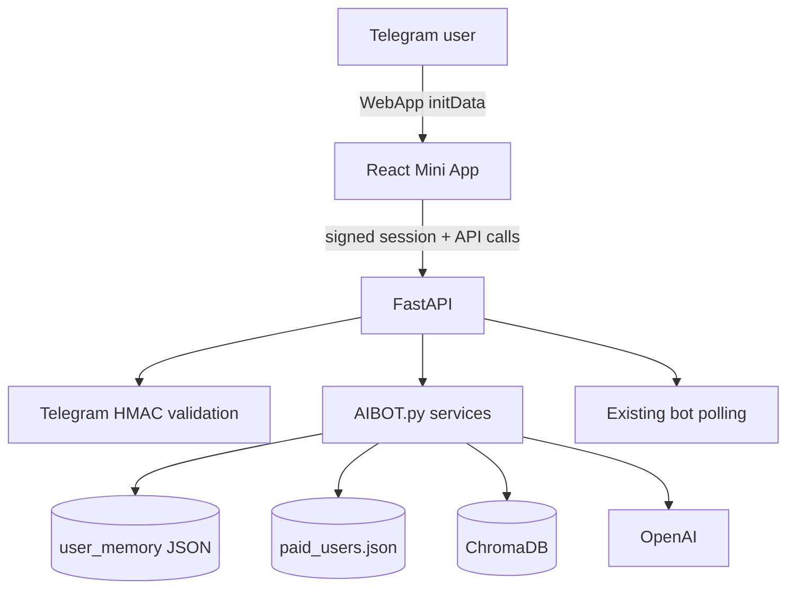

# UniVentureAI Admissions Hub

A production-oriented Telegram Mini App added **beside** the existing UniVentureAI chatbot. The chatbot keeps all commands and handlers. FastAPI starts that same Telegram application, exposes secure Mini App APIs, serves the React build, and reads/writes the same paid-user file, user-memory directory, ChromaDB collections, and OpenAI models.

Premium V4 combines the refined command center, guided profile intake, profile-aware Venture copilot, capacity/dependency-aware Flight Plan, 36-opportunity catalog, 30-university fit atlas, profile-gated Reach/Match/Lower-risk grouping, interactive SAT/IELTS quests, daily streaks, task-aware routing, reminders, and a useful notification desk.

## 1. Architecture



One Railway service is intentional. It avoids two services racing over different volumes and guarantees that the chatbot and Mini App see the same state.

Security flow:

1. React reads `Telegram.WebApp.initData`; it never sends a raw trusted `user_id`.
2. `/api/auth/telegram` validates Telegram’s HMAC and `auth_date` with the bot token.
3. The server issues a short-lived HMAC-signed session token.
4. Every protected request derives the user from that server-signed token.
5. Existing trial/paid access is checked before every AI or write endpoint.

## 2. Project structure

```text
univenture_admissions_hub/
├── AIBOT.py                     # original bot, preserved and minimally integrated
├── backend/
│   ├── auth.py                  # Telegram initData + signed sessions
│   ├── legacy.py                # direct bridge to existing bot services
│   ├── main.py                  # FastAPI routes, shared memory, bot lifespan
│   ├── product_logic.py         # deterministic routing and streak calculations
│   ├── prompts.py               # unique compact/full-review prompt contracts
│   └── schemas.py               # request validation
├── frontend/
│   ├── src/components/          # premium UI and structured result renderer
│   ├── src/screens/             # dashboard + all admissions tools
│   └── ...                      # Vite, React, TypeScript, Tailwind
├── scripts/generate_dev_init_data.py
├── tests/
├── Dockerfile
├── railway.json
├── requirements.txt
└── .env.example
```

## 3. Implemented API

| Method | Route | Purpose |
|---|---|---|
| `POST` | `/api/auth/telegram` | Validate Telegram `initData`, create session |
| `POST` | `/api/auth/dev` | Local-only auth when explicitly enabled |
| `GET` | `/api/me` | Shared profile, portfolio and readiness |
| `POST` | `/api/profile/name` | Save the student's manually entered display name |
| `POST` | `/api/profile/onboarding` | Save guided profile, direction and capacity signals |
| `POST` | `/api/profile/onboarding/skip` | Defer optional guided intake without blocking access |
| `GET` | `/api/dashboard` | Home dashboard payload |
| `GET` | `/api/practice/streak` | Persistent SAT/IELTS daily streak |
| `POST` | `/api/practice/complete` | Idempotently record a completed daily quest |
| `POST` | `/api/reminders` | Save a task reminder in student memory |
| `POST` | `/api/notifications/read` | Persist bell read state |
| `POST` | `/api/profile/update` | Safely update one portfolio section |
| `POST` | `/api/evaluate/essay` | Personal Statement or supplemental-specific review |
| `POST` | `/api/evaluate/ec` | Leadership, evidence and activity rewrite |
| `POST` | `/api/evaluate/ielts` | IELTS Writing, Speaking, Reading or Listening coaching |
| `POST` | `/api/coach` | Portfolio-aware Brainstorm Ideas and Rewrite My Text |
| `POST` | `/api/copilot` | Profile-aware Venture answers grounded in saved platform data |
| `POST` | `/api/sat/coach` | SAT Math/Reading & Writing sprint or mistake lab |
| `POST` | `/api/evaluate/recommendation` | Evaluate, brag sheet or teacher packet |
| `POST` | `/api/evaluate/portfolio` | Portfolio/project signal review |
| `POST` | `/api/evaluate/refine` | Hook, ending, specificity or section rewrite |
| `POST` | `/api/full-review` | On-demand detailed review of a saved compact evaluation |
| `POST` | `/api/school-finder` | Structured reach/match/lower-risk cards |
| `POST` | `/api/schools/save` | Save a card to the shared school list |
| `POST` | `/api/application-plan` | Personalized today/week/month/deadline roadmap |
| `POST` | `/api/application-plan/task-status` | Persist Flight Plan task completion |
| `POST` | `/api/boost` | Wow factor, language, readiness and tips |
| `POST` | `/api/files/extract` | Extract PDF, DOCX, TXT or Markdown |
| `POST` | `/api/feedback` | Persist feedback and forward it to configured bot admins |
| `GET` | `/api/subscription` | Existing trial/paid status |
| `GET` | `/api/health` | Railway health check |

All AI evaluation types have distinct compact schemas. Full reviews are not generated—and therefore do not consume full-review tokens—until the student taps the button. Saved Mini App evaluation IDs are preserved across memory reloads so that the full-review button remains valid.

The bottom navigation now contains the five product-level spaces: Home, Discover, Prep, AI Coach, and Portfolio. Portfolio is the rightmost item. Specialist tools such as essays live inside those hubs instead of consuming global navigation slots.

## 4. Run locally

### Backend

```bash
cd univenture_admissions_hub
python3 -m venv .venv
source .venv/bin/activate
pip install -r requirements-dev.txt
cp .env.example .env
```

For local browser UI work, set these in `.env`:

```dotenv
RUN_TELEGRAM_BOT=0
DEV_AUTH_BYPASS=1
PAYWALL_ENABLED=0
DATA_DIR=./data
PAID_DB_PATH=./data/paid_users.json
CHROMA_PATH=./data/chroma_store
MINI_APP_URL=http://localhost:5173
```

Use a syntactically valid placeholder bot token for UI-only work. AI actions require a real OpenAI key. Start the API:

```bash
uvicorn backend.main:app --reload --port 8000
```

### Frontend

In another terminal:

```bash
cd univenture_admissions_hub/frontend
npm install
npm run dev
```

Open `http://localhost:5173`. Vite proxies `/api` to port `8000`.

### Test real Telegram signature validation locally

Disable the dev bypass, export the real bot token, then generate a correctly signed payload:

```bash
export TELEGRAM_BOT_TOKEN='your-real-token'
export VITE_TELEGRAM_INIT_DATA="$(python scripts/generate_dev_init_data.py)"
```

Restart the frontend dev server so Vite receives the variable. This tests the same HMAC path as Telegram. It is a development helper only; production always receives `initData` from Telegram itself.

## 5. Railway deployment

1. Merge this package directly into the top level of `UniVenture-bot`. Keep Railway’s **Root Directory** blank.
2. Use the included Dockerfile. Do not create a second bot service.
3. Attach one persistent Railway volume mounted at `/data`.
4. Copy the current production variables from the existing bot and add the values in `.env.example`.
5. Set at minimum:
   - `TELEGRAM_BOT_TOKEN`
   - `OPENAI_API_KEY`
   - `SESSION_SECRET` (generate with `openssl rand -hex 32`)
   - `DATA_DIR=/data`
   - `PAID_DB_PATH=/data/paid_users.json`
   - `CHROMA_PATH=/data/chroma_store`
   - `PAYWALL_ENABLED=1`
   - `RUN_TELEGRAM_BOT=1`
6. If this replaces an existing Railway bot deployment, attach or migrate the **same `/data` volume contents** before switching traffic. That preserves paid users, trials, memory and Chroma sources.
7. Deploy once and generate a Railway public HTTPS domain.
8. Set `MINI_APP_URL` to that exact HTTPS origin, for example `https://univenture.example.up.railway.app`, then redeploy.
9. Open the bot and send `/start`. The first keyboard row now contains **🚀 Open Admissions Hub**. The code also sets the persistent Telegram menu button to **Admissions Hub**.
10. In BotFather, use `/setdomain` if Telegram asks you to authorize the production domain. Use only the hostname, without a path.

The included health check is `/api/health`. The Docker image builds React first, then copies `frontend/dist` into the FastAPI image.

## 6. Data compatibility

No migrations are required for existing users.

- Existing fields under `profile`, `writing`, `application`, `history`, and `drafts` remain untouched.
- New Mini App state is additive under `memory["miniapp"]`.
- Practice days, reminders, and notification read state are additive under `memory["miniapp"]`; no migration is required.
- New portfolio sections (`projects`, `recommendations`, `deadlines`, and `school_list`) are additive under `memory["application"]`.
- Chroma collection names remain `global_<topic>` and use the bot’s existing embedding configuration.
- The original slash commands, admin commands, teaching commands, payment proof flow, reminders, menus, file handlers, and chat answers remain registered.

## 7. Verification commands

```bash
python -m compileall AIBOT.py backend scripts
python -m unittest discover -s tests -v
npm --prefix frontend run build
docker build -t univenture-admissions-hub .
docker run --env-file .env -p 8000:8000 univenture-admissions-hub
curl http://localhost:8000/api/health
```

## 8. Manual test checklist

- Open only through Telegram and confirm first launch asks the student to enter a preferred name manually.
- Tamper with `initData` and confirm authentication returns `401`.
- Confirm an expired user can see access status but AI actions return the paywall.
- Confirm a trial user and an activated paid user can run every tool.
- Update GPA in My Portfolio, then open the chatbot `/profile` and confirm the same value is present.
- Run one Personal Statement and one supplemental review; confirm the headings and advice are different.
- Tap **Get Full Detailed Review** and confirm it runs only after the tap.
- Confirm ten activity and ten award slots appear immediately; save, reopen, edit, and confirm the structured entries remain.
- Open Discover with an expired account and confirm programs/deadlines remain visible.
- Run Brainstorm, Rewrite, SAT Math, SAT Reading & Writing, and all four IELTS skill modes.
- Submit feedback and confirm it reaches the configured admin account.
- Save a school, refresh, and confirm it remains in `application.school_list`.
- Generate a plan, return Home, and confirm Today’s Priority uses the latest plan.
- Upload one PDF, DOCX, and TXT under 5 MB from Essay, AI Coach, EC, IELTS, Recommendation, Portfolio, Boost, and SAT Mistake Lab.
- Restart Railway and confirm paid users, memory and Chroma sources persist.
- Test `/start`, `/teach`, `/stats`, `/pay`, `/mysub`, `/activate`, uploads, and ordinary chatbot answers after deployment.

See [`docs/AIBOT_INTEGRATION.md`](docs/AIBOT_INTEGRATION.md) for the exact bot modifications.
